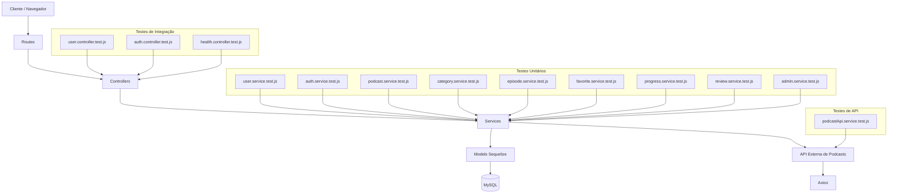

# Relatório de Implementação TDD - PodWave

## 1. Visão Geral do Projeto

O PodWave é uma plataforma de streaming de podcasts onde os usuários podem explorar conteúdos organizados por categorias, acompanhar episódios, favoritar podcasts, registrar progresso de reprodução e interagir por meio de avaliações.

O projeto foi desenvolvido utilizando Node.js, Express.js, Sequelize e Vitest, seguindo a metodologia Test-Driven Development (TDD).

---

## 2. Funcionalidade Principal Escolhida

A funcionalidade principal utilizada para aplicação do TDD foi o Módulo de Usuários, responsável pelas regras de cadastro, validação de dados, segurança e controle de acesso.

### Regras de Negócio Implementadas

* O nome deve possuir no mínimo 3 caracteres.
* O e-mail deve possuir formato válido.
* A senha deve possuir no mínimo 6 caracteres.
* O campo password_hash não pode ser exposto ao usuário.
* Apenas o próprio usuário ou administradores podem alterar informações do perfil.
* Apenas administradores podem acessar funcionalidades administrativas.

---

## 3. Aplicação do Ciclo TDD

O desenvolvimento foi realizado seguindo o ciclo Red-Green-Refactor.

### Red

Inicialmente foram criados os testes unitários definindo o comportamento esperado da funcionalidade.

Como a implementação ainda não existia, os testes falharam.

### Green

Foi implementada a menor quantidade possível de código para que os testes passassem.

Após a implementação, todos os testes executaram com sucesso.

### Refactor

Com os testes passando, o código foi reorganizado para melhorar legibilidade, reutilização e manutenção, sem alterar o comportamento validado pelos testes.

---

## 4. Exemplos de Testes Unitários

### Exemplo 1 - Validação de Cadastro de Usuário

Arquivo:

src/modules/user/**tests**/user.service.test.js

Objetivo:

Garantir que os dados obrigatórios do cadastro sejam validados corretamente.

Verificações:

* Nome mínimo de 3 caracteres.
* E-mail válido.
* Senha mínima de 6 caracteres.

```javascript
it('deve validar dados obrigatórios de cadastro', () => {
  const result = validateUserRegistration({
    name: 'Ca',
    email: 'email-invalido',
    password: '123'
  });

  expect(result.isValid).toBe(false);
});
```

### Exemplo 2 - Sanitização de Dados

Arquivo:

src/modules/user/**tests**/user.service.test.js

Objetivo:

Garantir que informações sensíveis não sejam retornadas ao cliente.

```javascript
it('não deve expor password_hash ao sanitizar usuário', () => {
  const user = sanitizeUser({
    id: 1,
    name: 'Ana',
    password_hash: 'hash'
  });

  expect(user.password_hash).toBeUndefined();
});
```

### Exemplo 3 - Controle de Permissões

Arquivo:

src/modules/user/**tests**/user.service.test.js

Objetivo:

Garantir que apenas o proprietário da conta ou administradores possam realizar alterações.

```javascript
it('deve permitir atualização pelo próprio usuário ou admin', () => {
  expect(canUpdateOwnProfile({ id: 1, role: 'user' }, 1)).toBe(true);
});
```

---
## 4. Lições Aprendidas

Durante o desenvolvimento do projeto PodWave utilizando Test-Driven Development (TDD), foi possível compreender na prática a importância dos testes automatizados para garantir a qualidade do software.

Inicialmente, escrever os testes antes da implementação parecia aumentar o tempo de desenvolvimento. Entretanto, conforme o projeto evoluiu, os testes passaram a servir como uma rede de segurança para realizar alterações e refatorações com confiança.

Entre os principais aprendizados estão:

- Melhor compreensão dos requisitos antes da implementação.
- Desenvolvimento orientado por comportamento esperado.
- Redução de erros durante alterações no código.
- Maior organização da arquitetura em camadas.
- Facilidade para validar regras de negócio automaticamente.
- Maior confiança durante refatorações.

Além disso, a utilização de mocks, testes de integração com Supertest e testes de API com Axios Mock Adapter demonstrou como isolar dependências externas e validar diferentes cenários sem depender de banco de dados ou serviços reais.

## 5. Uso de Mocks & Utilização da Cobertura de Código

O projeto utiliza mocks através da biblioteca Vitest para isolar dependências externas durante os testes.Durante o desenvolvimento foram utilizados relatórios de cobertura de código gerados pelo Vitest através do comando:

```bash
npm run test:coverage

Arquivo:

src/modules/user/**tests**/user.mock.test.js

Recursos utilizados:

* vi.fn()
* vi.mock()
* mocks de funções simuladas

Benefícios:

* Maior velocidade na execução dos testes.
* Independência de banco de dados.
* Isolamento da lógica de negócio.
* Maior confiabilidade dos testes.

---

## 6. Testes de Integração

Foram implementados testes de integração utilizando Supertest para validar o comportamento HTTP da aplicação.

Arquivos:

* src/modules/health/**tests**/health.controller.test.js
* src/modules/user/**tests**/user.controller.test.js
* src/modules/auth/**tests**/auth.controller.test.js

Cenários testados:

* GET /health
* GET /register
* POST /register com sucesso
* POST /register com erro
* GET /login
* POST /login com sucesso
* POST /login com erro
* POST /logout

Total de testes de integração: 10

---

## 7. Testes de API Externa

Foram implementados testes simulando integração com API externa utilizando Axios e Axios Mock Adapter.

Arquivo:

src/modules/podcast/**tests**/podcastApi.service.test.js

Cenários testados:

* Retorno de lista de podcasts.
* Retorno de podcast válido.
* Retorno de lista vazia.
* Erro HTTP 500.
* Falha de conexão de rede.

Total de testes de API: 5

---

## 8. Refatorações Realizadas

### Refatoração 1 - Centralização das Validações

Antes:

As validações estavam distribuídas pelo Controller.

Depois:

As validações foram movidas para funções específicas do Service.

Benefícios:

* Melhor separação de responsabilidades.
* Código mais organizado.
* Maior facilidade para testes.

### Refatoração 2 - Sanitização de Dados

Antes:

Os objetos de usuário poderiam expor informações sensíveis.

Depois:

Foi criada a função sanitizeUser() para remover password_hash.

Benefícios:

* Maior segurança.
* Reutilização de código.
* Padronização das respostas.

---

## 9. Resultados Obtidos

O projeto possui:

* 48 testes automatizados.
* Testes unitários.
* Testes de integração.
* Testes de API externa.
* Uso de mocks.
* Cobertura de código configurada.
* Aplicação da metodologia TDD.

Todos os testes executam com sucesso através dos comandos:

```bash
npm test
```

```bash
npm run test:coverage
```

O desenvolvimento seguiu os princípios do Test-Driven Development, garantindo qualidade, confiabilidade e facilidade de manutenção do código.

## Refatorações Realizadas

### Refatoração 1
Antes:
Validações espalhadas no controller.

Depois:
Validações movidas para o Service.

Benefício:
Separação de responsabilidades e maior facilidade para testes.

### Refatoração 2
Antes:
Retorno direto dos dados do usuário.

Depois:
Criação da função sanitizeUser().

Benefício:
Proteção contra exposição de password_hash.

## Diagrama de Arquitetura


### Descrição da Arquitetura

O projeto PodWave foi desenvolvido utilizando uma arquitetura em camadas para facilitar manutenção, testes e evolução do sistema.

- **Routes:** recebem as requisições HTTP.
- **Controllers:** controlam o fluxo da aplicação e retornam respostas ao usuário.
- **Services:** concentram as regras de negócio.
- **Models (Sequelize):** fazem a comunicação com o banco de dados MySQL.
- **API Externa:** simulada através do Axios e Axios Mock Adapter para testes de integração com serviços externos.

### Estratégia de Testes

O projeto utiliza três níveis de testes:

#### Testes Unitários
Validam funções isoladas da camada Service utilizando mocks quando necessário.

Arquivos:
- user.service.test.js
- auth.service.test.js
- podcast.service.test.js
- category.service.test.js
- episode.service.test.js
- favorite.service.test.js
- progress.service.test.js
- review.service.test.js
- admin.service.test.js

#### Testes de Integração
Validam o comportamento HTTP das rotas e controllers utilizando Supertest.

Arquivos:
- user.controller.test.js
- auth.controller.test.js
- health.controller.test.js

#### Testes de API
Validam integrações externas simuladas utilizando Axios Mock Adapter.

Arquivo:
- podcastApi.service.test.js

Atualmente o projeto possui:
- 43 testes unitários e de integração
- 5 testes de API
- Cobertura superior a 80% na funcionalidade principal
- Aplicação completa do ciclo TDD (Red → Green → Refactor)
